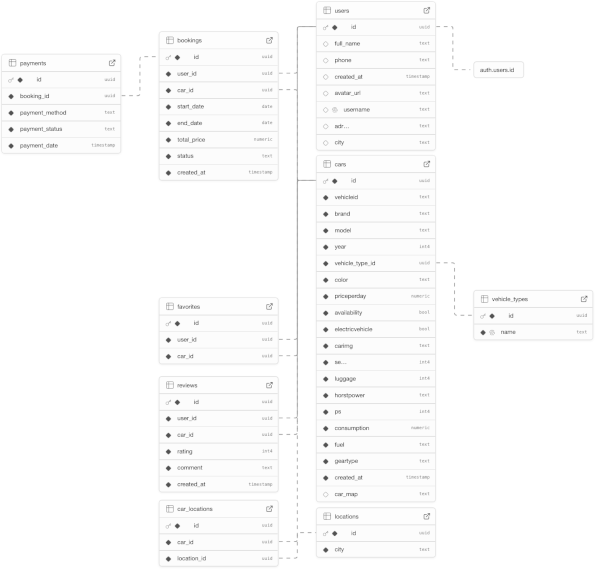

# 🚗 MØRENT – Moderne Car Rental Web App

Willkommen bei **MØRENT**, unserem Abschlussprojekt bei SuperCode. 


Diese moderne Autovermietungsplattform ermöglicht es Nutzern, Fahrzeuge bequem online zu suchen, zu filtern und zu buchen.

🔗 **Live-Demo:** [morent-oguz-mona-mina-nina.vercel.app](https://morent-oguz-mona-mina-nina.vercel.app)


______
## Funktionsübersicht


- 🔍 **Filterfunktionen:** Filtern Sie Fahrzeuge nach Kategorie, Preis, Sitzanzahl, Location und Horstpower.
- 📄 **Detailansicht:** Erhalten Sie umfassende Informationen und Bewertungen zu jedem Fahrzeug. (wir empfehlen die SuperCode Ape 👾)
- ❤️ **Favoriten:** Speichern Sie Ihre Lieblingsfahrzeuge für später.
- 👤 **Profilseite:** Userdaten und Userbild aktualisieren. (audiosensitive bitte nicht 5x das Profilbild klicken 🥳)
- 🔐 **Benutzerauthentifizierung:** Anmeldung und Registrierung mit Supabase.
- 📱 **Responsive Design:** Optimiert für alle Bildschirmgrößen.
- 💁🏽‍♀️ **TeamPage:**  Wir stellen uns vor. 🌳🌸🍁🍀"How it works" im Footer klicken. 


_______

## TechStack:

INSERT collage of logos

- Frontend: HTML, CSS, Typescript, React
- Framework: Vite
- Code Editor: Visual Code Studio
- Backend: Supabase (Datenbank & Auth)
- Version Control: Github
- Deployment: Vercel
- Projectmanagement / TeamOrga:  Miro
- Communication: Discord, Google Meet
- Assigned ProjectDesign: Figma
- Libs, Packages, Tools: TanStack React-Query, React-Router, FramerMotion, 
________
## Languages:

HTML, CSS, JS, TS, SQL, 🇩🇪, 🇬🇧

________
## Check out the deployed page
[MØRENT](https://morent-oguz-mona-mina-nina.vercel.app)

________
## Get started
to run the Project on your local machine

INSERT the steps

1. clone the repo
2. npm i
3. npm run dev
3. what else? eigene datenbank und die connecten?

_____________
## Database

insert some Text about supabase
____________
## Authentication
insert some text about supabase

___________
## Routing
insert img of routing miro
TODO update routing with protected routes

____________
## Third-party-libraries and tools

-list what we used, and explain what we did with it
_____________
## Contributors
🌳 Oguz
🌸 Mona
🍁 Mina
🍀 Nina

insert roles, github links, 

_____________

_________
initial Vite-Filling:

# React + TypeScript + Vite

This template provides a minimal setup to get React working in Vite with HMR and some ESLint rules.

Currently, two official plugins are available:

- [@vitejs/plugin-react](https://github.com/vitejs/vite-plugin-react/blob/main/packages/plugin-react) uses [Babel](https://babeljs.io/) for Fast Refresh
- [@vitejs/plugin-react-swc](https://github.com/vitejs/vite-plugin-react/blob/main/packages/plugin-react-swc) uses [SWC](https://swc.rs/) for Fast Refresh

## Expanding the ESLint configuration

If you are developing a production application, we recommend updating the configuration to enable type-aware lint rules:

```js
export default tseslint.config({
  extends: [
    // Remove ...tseslint.configs.recommended and replace with this
    ...tseslint.configs.recommendedTypeChecked,
    // Alternatively, use this for stricter rules
    ...tseslint.configs.strictTypeChecked,
    // Optionally, add this for stylistic rules
    ...tseslint.configs.stylisticTypeChecked,
  ],
  languageOptions: {
    // other options...
    parserOptions: {
      project: ['./tsconfig.node.json', './tsconfig.app.json'],
      tsconfigRootDir: import.meta.dirname,
    },
  },
})
```

You can also install [eslint-plugin-react-x](https://github.com/Rel1cx/eslint-react/tree/main/packages/plugins/eslint-plugin-react-x) and [eslint-plugin-react-dom](https://github.com/Rel1cx/eslint-react/tree/main/packages/plugins/eslint-plugin-react-dom) for React-specific lint rules:

```js
// eslint.config.js
import reactX from 'eslint-plugin-react-x'
import reactDom from 'eslint-plugin-react-dom'

export default tseslint.config({
  plugins: {
    // Add the react-x and react-dom plugins
    'react-x': reactX,
    'react-dom': reactDom,
  },
  rules: {
    // other rules...
    // Enable its recommended typescript rules
    ...reactX.configs['recommended-typescript'].rules,
    ...reactDom.configs.recommended.rules,
  },
})
```
